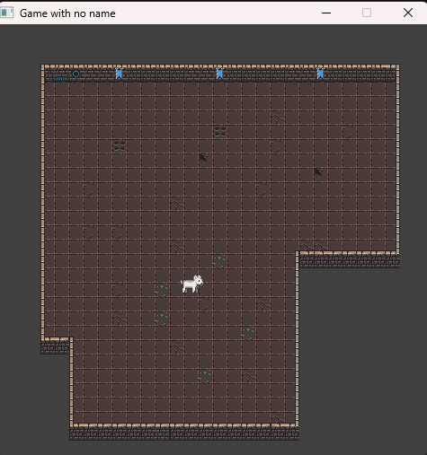

# Game Project README

## Project Overview

This project is a game developed in C programming language using the Simple DirectMedia Layer (SDL) library. SDL is a cross-platform development library designed to provide low-level access to audio, keyboard, mouse, and display functionalities.

## Prerequisites

Before running the game, make sure you have the following dependencies installed:

- C compiler (e.g., GCC)

## Getting Started

1. Clone the repository:

    ```bash
    git clone git@github.com:souhailBektachi/game-SDL2-C.git
    ```

2. Navigate to the project directory:

    ```bash
    cd game-SDL2-C
    ```

3. Build the project:

    ```bash
    make
    ```

4. Run the game:

    ```bash
    ./game.exe
    ```
## Screenshots



